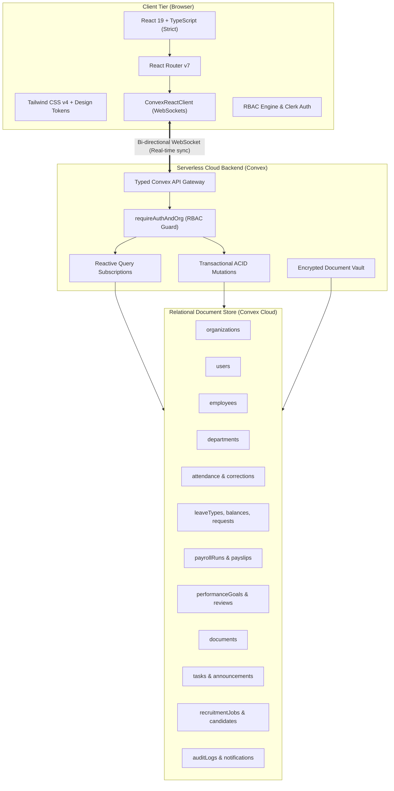

# Enterprise Tech Stack & Architectural Specification
## Apex Global — Enterprise Workforce & HR Management Platform

---

## 1. Executive Summary & Architecture Overview

**Apex Global** is a production-grade, enterprise-tier Human Resources and Workforce Management platform engineered to the UX and performance standards of modern SaaS leaders (Linear, Stripe, and Workday).

The system features an **end-to-end TypeScript architecture**, coupling a high-performance **React 19** Single Page Application with a **Convex** reactive cloud database and serverless backend.



---

## 2. Frontend Technology Stack

| Layer / Technology | Version | Architectural Role & Implementation |
| :--- | :--- | :--- |
| **React** | `^19.2.8` | Core UI engine leveraging modern hooks (`useActionState`, `useOptimistic`), concurrent rendering, and strict mode. |
| **TypeScript** | `~6.0.2` | 100% strict static typing across components, props, state contexts, and API payloads. |
| **Vite** | `^8.2.2` | Build tool offering instant Hot Module Replacement (HMR) and optimized rollup production bundling. |
| **Tailwind CSS** | `^4.3.3` | Utility-first CSS framework configured via `@tailwindcss/vite` and `@tailwindcss/postcss`. |
| **React Router DOM** | `^7.18.3` | Client-side routing with nested layouts, declarative loaders, and role-based route guards. |
| **Recharts** | `^3.10.1` | Declarative SVG charting library for department headcount distribution, attendance curves, and salary metrics. |
| **Lucide React** | `^1.41.0` | Unified, enterprise-grade vector icon system. |
| **clsx & tailwind-merge** | `^2.1.1` / `^3.6.0` | Dynamic class construction with conflict resolution via the standard `cn()` utility. |
| **date-fns** | `^4.4.0` | Date manipulation, calendar formatting, and timesheet delta calculations. |

---

## 3. Backend & Cloud Infrastructure

| Category | Solution | Technical Specifications |
| :--- | :--- | :--- |
| **Runtime Language** | **TypeScript** | 100% written in TypeScript running on serverless V8 engines. |
| **Cloud Platform** | **Convex Cloud** | Active deployment: `valuable-aardvark-358` (`https://valuable-aardvark-358.convex.cloud`). |
| **Data Synchronization** | **Reactive WebSockets** | Automatic push updates to client state when queries or mutations execute. |
| **Data Integrity** | **ACID Transactions** | Every mutation executes atomically, guaranteeing consistency without race conditions. |
| **File Storage** | **Convex File Store** | Encrypted binary storage for employee identification, resumes, tax declarations, and payslips. |

---

## 4. Database Architecture & Schema Design

The database schema comprises **22 relational tables** with **41 indexes**:

```
├── Core Governance
│   ├── organizations       (Enterprise tenants, fiscal year rules, currencies)
│   ├── settings            (Working days, clock-in policies, two-factor rules)
│   └── users               (Role bindings, Clerk IDs, department links)
│
├── Personnel & Structure
│   ├── departments         (Hierarchy, headcount targets, annual budgets)
│   └── employees           (Personal details, emergency contacts, compensations, skills)
│
├── Workforce Operations
│   ├── attendance          (Check-in/out stamps, total hours, work modes)
│   ├── attendanceCorrections(Timesheet dispute & adjustment workflows)
│   ├── leaveTypes          (PL, CL, SL, ML, PTL, COMP policies)
│   ├── leaveBalances       (Allocated, used, pending, remaining days per year)
│   ├── leaveRequests       (Multi-level manager approval lifecycle)
│   └── holidays            (Corporate & public calendar dates)
│
├── Compensation & Performance
│   ├── payrollRuns         (Pay cycle batches, gross, deductions, net)
│   ├── payslips            (Itemized: Basic, HRA, Allowances, PF, Tax, PT)
│   ├── performanceGoals    (Strategic OKRs, milestones, progress percentages)
│   └── performanceReviews  (Annual/quarterly 360 appraisals & ratings)
│
└── Governance & Productivity
    ├── documents           (Confidentiality-gated corporate vault)
    ├── tasks               (Kanban task management: TODO, IN_PROGRESS, COMPLETED)
    ├── announcements       (Executive bulletins & notices)
    ├── recruitmentJobs     (Open positions & requisition tracking)
    ├── recruitmentCandidates(Candidate stages: Applied → Offer → Hired)
    ├── notifications       (Targeted user alerts)
    └── auditLogs           (Immutable security compliance log)
```

---

## 5. Security & Role-Based Access Control (RBAC)

The system enforces strict multi-tenant authorization through 4 distinct personas:

| Role | Access Level & Capabilities |
| :--- | :--- |
| **`SUPER_ADMIN`** | Full platform control, corporate governance, department budget allocations, compensation changes, and immutable audit log inspection. |
| **`HR_ADMIN`** | Complete employee lifecycle management, onboarding wizard, leave policies, holiday calendars, and candidate recruitment pipeline. |
| **`MANAGER`** | Department timesheet reviews, team leave request approvals, operational task assignment, and quarterly performance reviews. |
| **`EMPLOYEE`** | Self-service shift check-in/out, personal leave applications, payslip viewing/downloading, and goal milestone updates. *(Salary data of other employees is automatically redacted at query time).* |

---

## 6. Enterprise UI Design System

* **Typography**:
  * **Headings**: `Manrope` (Font weights: 500, 600, 700, 800)
  * **UI & Tabular Grids**: `Inter` (Font weights: 300, 400, 500, 600, 700)
  * **Financial & Numerical Data**: `JetBrains Mono`
* **Color System**:
  * **Light Theme**: Background `#F8F9FA`, Surface `#FFFFFF`, Border `#E5E7EB`, Text `#171717`
  * **Dark Theme**: Background `#101113`, Surface `#17181B`, Border `#292B30`, Text `#F5F5F5`
  * **Brand Primary**: Indigo/Blue (`#2563EB`)
* **Standards**: Inspired by Stripe and Linear: dense data scanning, high contrast ratios, zero generic placeholder cards.

---

## 7. Tooling & Development Workflow

* **Package Manager**: `npm`
* **Linter**: **Oxlint** (`v1.79.0`) - High-speed Rust-based linter.
* **Commands**:
  * `npm run dev`: Launch local Vite dev server.
  * `npx convex dev`: Start Convex Cloud reactive functions watcher and type generator.
  * `npm run build`: Typecheck with `tsc -b` and produce optimized production bundle.
  * `npx convex dashboard`: Open deployment management portal directly.
